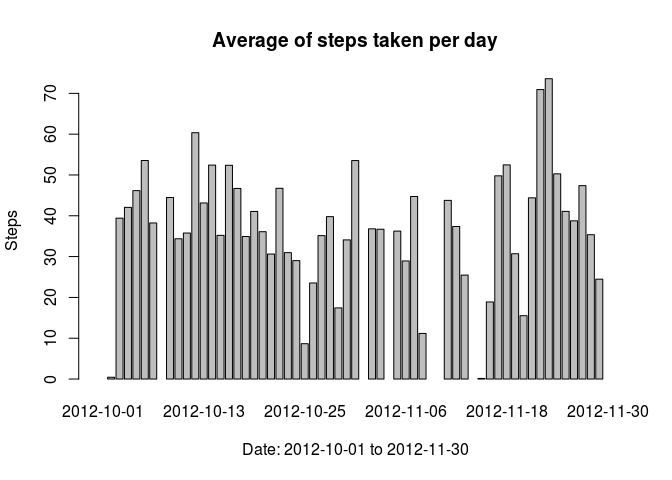
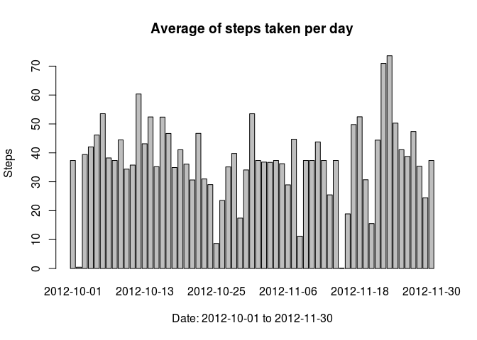

# Reproducible Research: Peer Assessment 1
Jona N  
Jan 13th, 2015  

## Loading and preprocessing the data


```r
##unzip("activity.zip")
dataset <- read.csv("activity.csv")
summary(dataset)
```

```
##      steps               date          interval   
##  Min.   :  0.0   2012-10-01:  288   Min.   :   0  
##  1st Qu.:  0.0   2012-10-02:  288   1st Qu.: 589  
##  Median :  0.0   2012-10-03:  288   Median :1178  
##  Mean   : 37.4   2012-10-04:  288   Mean   :1178  
##  3rd Qu.: 12.0   2012-10-05:  288   3rd Qu.:1766  
##  Max.   :806.0   2012-10-06:  288   Max.   :2355  
##  NA's   :2304    (Other)   :15840
```


## What is mean total number of steps taken per day?


```r
##tidyData<-data[which(data$steps>=0),]

## In this part we're ignoring the missing values in the dataset

## computing the number of steps taken each day
sumData<-with(dataset, tapply(steps, date, sum))
barplot(sumData, main="Total number of steps taken each day",
        xlab="Date: 2012-10-01 to 2012-11-30", ylab="Steps")
```

 

```r
## computing the mean of steps taken each day
meanData<-with(dataset, tapply(steps, date, mean))
barplot(meanData, main="Average of steps taken per day",
        xlab="Date: 2012-10-01 to 2012-11-30", ylab="Steps")
```

 

```r
mean(meanData, na.rm=TRUE)
```

```
## [1] 37.38
```


## What is the average daily activity pattern?

```r
with(aggregate(steps ~ interval, data=dataset, mean, na.rm = T),
     plot(interval, steps, type="l", main="Average daily activity pattern",
     xlab="Interval", ylab="Steps averaged across all days"))
```

 

## Imputing missing values

### Calculate and report the total number of missing values in the dataset (i.e. the total number of rows with NAs)

```r
sum(is.na(dataset$steps))
```

```
## [1] 2304
```

### Devise a strategy for filling in all of the missing values in the dataset. The strategy does not need to be sophisticated. For example, you could use the mean/median for that day, or the mean for that 5-minute interval, etc.

```r
## Computing the mean for that 5-minute interval
library("plyr")
dd<-dataset
pp <- ddply(dd, .(interval), summarize, means = mean(steps, na.rm=TRUE))
```

### Create a new dataset that is equal to the original dataset but with the missing data filled in.

```r
## Filling all the missing values of the dataset in new dataset
l<-which(is.na(dataset))
dataset$steps[l]<-pp$means[pp$interval %in% dataset$interval[l]]
sum(is.na(dataset$steps))
```

```
## [1] 0
```

```r
head(dataset)
```

```
##     steps       date interval
## 1 1.71698 2012-10-01        0
## 2 0.33962 2012-10-01        5
## 3 0.13208 2012-10-01       10
## 4 0.15094 2012-10-01       15
## 5 0.07547 2012-10-01       20
## 6 2.09434 2012-10-01       25
```

### Make a histogram of the total number of steps taken each day and Calculate and report the mean and median total number of steps taken per day. Do these values differ from the estimates from the first part of the assignment? What is the impact of imputing missing data on the estimates of the total daily number of steps?

```r
## computing the number of steps taken each day
sumData<-with(dataset, tapply(steps, date, sum))
barplot(sumData, main="Total number of steps taken each day",
        xlab="Date: 2012-10-01 to 2012-11-30", ylab="Steps")
```

 

```r
## computing the mean of steps taken each day
meanData<-with(dataset, tapply(steps, date, mean))
barplot(meanData, main="Average of steps taken per day",
        xlab="Date: 2012-10-01 to 2012-11-30", ylab="Steps")
```

 

## Are there differences in activity patterns between weekdays and weekends?

### Create a new factor variable in the dataset with two levels – “weekday” and “weekend” indicating whether a given date is a weekday or weekend day.

```r
dataset$week<-as.character(weekdays(as.Date(dataset$date)))
dataset$week[!dataset$week %in% c("sábado","domingo")]<-"weekday"
dataset$week[dataset$week %in% c("sábado","domingo")]<-"weekend"
dataset$week<-factor(dataset$week, levels = c("weekday", "weekend"))
table(dataset$week)
```

```
## 
## weekday weekend 
##   12960    4608
```

```r
str(dataset)
```

```
## 'data.frame':	17568 obs. of  4 variables:
##  $ steps   : num  1.717 0.3396 0.1321 0.1509 0.0755 ...
##  $ date    : Factor w/ 61 levels "2012-10-01","2012-10-02",..: 1 1 1 1 1 1 1 1 1 1 ...
##  $ interval: int  0 5 10 15 20 25 30 35 40 45 ...
##  $ week    : Factor w/ 2 levels "weekday","weekend": 1 1 1 1 1 1 1 1 1 1 ...
```

### Make a panel plot containing a time series plot (i.e. type = "l") of the 5-minute interval (x-axis) and the average number of steps taken, averaged across all weekday days or weekend days (y-axis). See the README file in the GitHub repository to see an example of what this plot should look like using simulated data.


re differences in activity patterns between weekdays and weekends?
